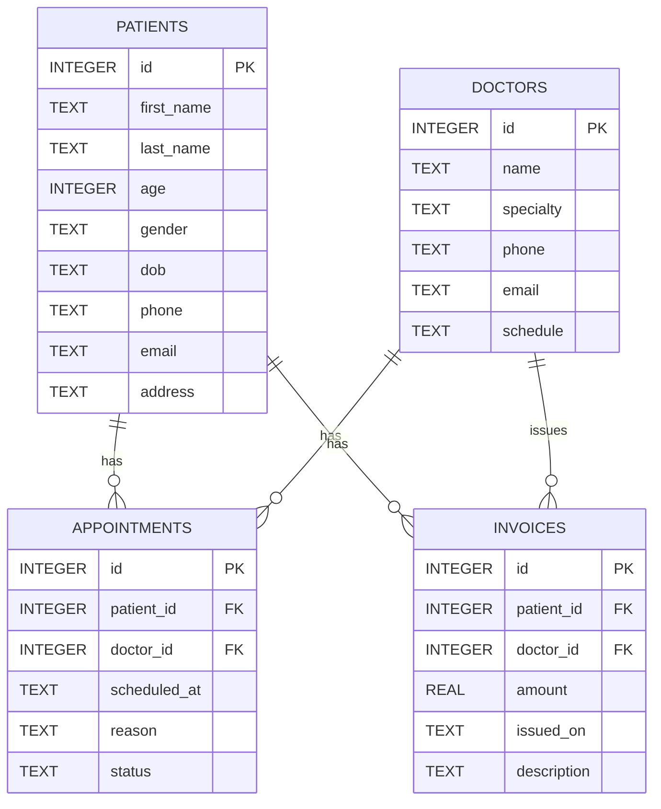

# Clinic-Management-System

## System Diagrams (Mermaid)

### Level 0 (Context Diagram)

```mermaid
graph LR
  User[User / Frontend] -->|Uses UI| CMS[Clinic Management System]
  Admin[Admin] -->|Manages| CMS
  CMS -->|Reads/Writes| DB[(clinic.db)]
  CMS -->|Serves| Frontend[Static Assets]
  External[External Services (e.g., Email)] -->|Optional| CMS
```

### Level 1 (Major Subsystems)

```mermaid
graph LR
  UI[Frontend SPA] -->|HTTP| Router[HTTP Router (PatientRouter)]
  Router --> Services[Services Layer (patients, doctors, invoices, billing, reports)]
  Services --> DB[(SQLite clinic.db)]
  Router --> Static[Static File Server]
  UI -->|Assets| Static
  Router -->|Uses| Responses[Response Helpers]
  Router -->|Uses| Request[Request Parser]
```

### Level 2 (Detailed Process Decomposition)

```mermaid
graph LR
  Patients[Patients Service] -->|CRUD| Queries[DB Queries (patients_* )]
  Doctors[Doctors Service] -->|CRUD| Queries
  Invoices[Invoice Service] -->|CRUD| Queries
  Billing[Billing Service] -->|Forwards to| InvoiceService[Invoice Service]
  Appointments[Appointments] -->|CRUD| Queries
  Router --> Patients
  Router --> Doctors
  Router --> Billing
  Router --> Invoices
  Router --> Appointments
```

### ER Diagram (Data Model)



## About this project

- Purpose: a minimal Clinic Management System (CMS) that provides CRUD for patients, doctors, billing/invoices, and appointments, plus simple reports.
- Backend: lightweight Python HTTP server with a router (`PatientRouter`) that maps HTTP endpoints to service functions.
- Services: small service layer (`services/*`) forwards requests to SQL query implementations (`database/queries.py`).
- Data store: SQLite database (`clinic.db`) stores `patients`, `doctors`, `appointments`, and `invoices` tables.
- Frontend: single-page application (SPA) using vanilla JavaScript under `frontend/assets/js` with controllers, components, and a client-side router.
- Core helpers: request parsing, response helpers, static file serving, and basic CORS middleware are in `core/`.

Design notes:
- The router performs lazy imports of services to keep startup lightweight and avoid import-time errors.
- The `billing` endpoints reuse `invoice` logic via a compatibility layer so older routes remain supported.
- The project intentionally keeps separation between routing, services, and database queries to make testing and maintenance easier.

If you want, I can also generate PNG/SVG exports of these diagrams or commit these changes.
# Feature: project README — documents setup and usage. Connects: contributors and developers.
# Clinic-Management-System